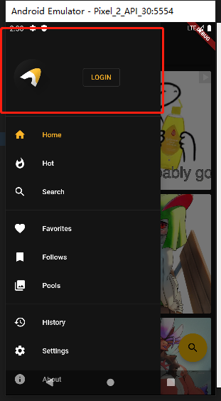

# 文件夹结构
├── client
├── comment
├── denylist
├── dtext
├── follow          收藏的tag的追踪列表     
├── history
├── interface       用来存放公用layout + component的
├── pool
├── post
├── settings
├── tag
├── ticket
├── topic
├── user
└── wiki

## follow
├── data
|  ├── actions.dart
|  ├── controller.dart
|  └── follow.dart
├── follow.dart
└── widgets
   ├── combined.dart        follow page 的combined结构
   ├── drawer.dart
   ├── icon.dart
   ├── settings.dart
   ├── split.dart           follow page 的 split结构
   ├── switcher.dart        page主入口，以settings.splitFollows切换combined或split结构
   └── tile.dart            split page的显示组件块
## interface        用来存放公用layout + component的
├── data
|  ├── action.dart
|  ├── client.dart
|  ├── controller.dart
|  ├── hosts.dart
|  ├── text.dart
|  ├── theme.dart           存放主题
|  └── updater.dart
├── interface.dart
└── widgets
    ├── action.dart
    ├── animation.dart
    ├── appbar.dart
    ├── dialog.dart
    ├── divider_tile.dart
    ├── drawer.dart
    ├── link.dart
    ├── loading.dart
    ├── navigation.dart
    ├── notifiers.dart
    ├── padding.dart
    ├── pagination.dart
    ├── pop_tile.dart
    ├── range_dialog.dart
    ├── refreshing.dart
    ├── selection.dart
    ├── shadows.dart
    ├── sheet.dart
    ├── snackbar.dart
    ├── startup.dart
    ├── text_editor.dart
    ├── tiles.dart
    ├── votes.dart
    └── width.dart


# main流程
1. initializeSettings   初始化lib/settings/data/settings.dart
2. initializeAppInfo

# API
```dart
// https://api.flutter.dev/flutter/widgets/ValueListenableBuilder-class.html
// 传入valueListenable用来监听该值变化，然后更新视图
ValueListenableBuilder<T> class
```

# layout
## drawer 


- 主体  lib/interface/widgets/navigation.dart `NavigationDrawer`
  - lib/user/widgets/drawer.dart `UserDrawerHeader`
  - lib/interface/widgets/navigation.dart:111   生成下面的路由列表
